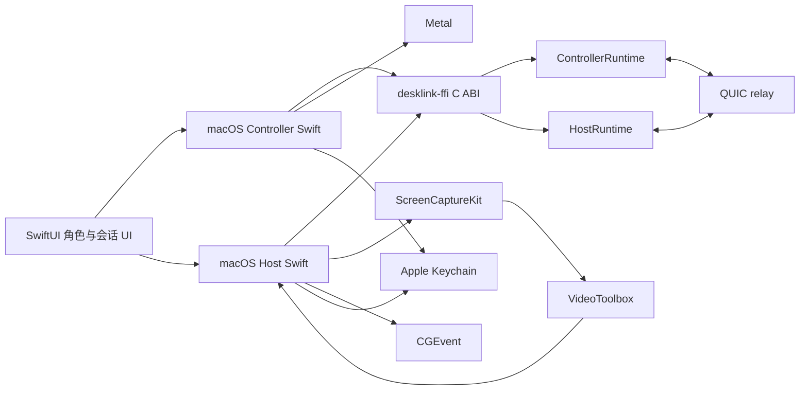

# macOS Apple Silicon 双端完成设计

> 设计日期：2026-07-16
>
> 目标平台：`aarch64-apple-darwin` / Apple Silicon macOS
>
> 交付范围：macOS 控制端 + macOS 被控端；iOS 暂缓；Windows/Linux 不在本轮验收范围内。

## 1. 目标与完成定义

本轮把 DeskLink 从“Windows 被控端 + macOS 控制端骨架”推进到 macOS Apple Silicon 上可独立运行的桌面双端：同一个 macOS 应用可以选择控制另一台电脑，或共享本机屏幕供另一台 DeskLink 控制。

完成定义包括：

- macOS 控制端能够通过一次性配对邀请建立端到端加密连接，使用 Keychain 持久保存控制端身份和已批准主机连接材料。
- macOS 控制端能够解码 VideoConfig/H.264、使用 Metal 显示最新画面，并发送鼠标移动、点击、拖动、滚轮、常用键盘和 Unicode 文本输入。
- macOS 被控端能够检查并引导屏幕录制和辅助功能权限，使用 ScreenCaptureKit 捕获选定显示器，使用 VideoToolbox 编码 H.264，并通过 CGEvent 注入远程输入。
- Rust 统一承担 relay、Noise 身份认证、会话审批、加密数据通道、重连、帧恢复和 `ReleaseAll`；Swift 不直接创建 QUIC socket，也不实现安全协议。
- 未授权控制端在屏幕采集和输入注入前被阻断；主机拒绝、断线、进程退出和权限不足不会遗留按键或鼠标按下状态。
- Swift 单元测试、Rust FFI/集成测试、Apple Silicon 原生链接和 macOS 应用检查全部通过。

## 2. 非目标

- 不实现 iOS UI、触控板模式、软键盘或二维码扫描；C ABI 只保持未来 iOS 可复用。
- 不修改 Windows 主机功能，不以 Windows 构建或 Windows runtime 冒烟作为本轮完成条件。
- 不实现账号、多人控制、文件传输、远程音频、剪贴板同步、录屏或虚拟桌面合成。
- macOS 第一版只支持当前用户登录桌面、一个活动控制端和一个被控会话。

## 3. 现有边界与主要缺口

当前 `crates/desklink-ffi` 已提供真实 `ControllerRuntime`，负责控制端 Noise 握手、能力协商、视频配置/分片接收、输入发送和关键帧请求；`apps/macos` 已有 Keychain 身份、H.264 Annex B/AVCC 转换、VideoToolbox 解码、Metal 显示和 SwiftUI 输入雏形。

当前缺口是：

1. `apps/macos` 只有控制端入口，缺少主机 runtime、屏幕采集、H.264 编码和输入注入。
2. FFI 只有 controller ABI，没有可供 macOS 原生采集/编码管线使用的 host ABI。
3. 控制端仍主要依赖环境变量，缺少正式的配对邀请粘贴、已批准主机存储、连接状态和权限/错误 UI。
4. VideoToolbox 当前 SDK 下的异步解码标志名称不再匹配 Swift 6.3.3，需要使用当前 SDK 可编译的 API 形式并覆盖测试。
5. 当前 SwiftUI 应用没有角色选择、Host 审批、屏幕录制权限、辅助功能权限和安全释放的完整生命周期。

## 4. 总体架构

采用“Rust 安全/传输 runtime + Swift 平台适配器”的边界：



### 4.1 Rust HostRuntime

在 `crates/desklink-ffi/src/host.rs` 增加可取消的 `HostRuntime`，在 `crates/desklink-ffi/src/host_worker.rs` 增加后台 worker。它复用现有 `desklink-crypto`、`desklink-protocol`、`desklink-session` 和 `desklink-transport`，职责是：

- 生成带 session、relay join secret、host verify key 和过期时间的固定长度 `PairingInvite`。
- 以 host 角色加入 relay，执行 Noise responder 握手并验证 controller 的设备 ID、公钥和 transcript 签名。
- 在能力协商前发出一次 `ApprovalRequested` 事件并等待 Swift 明确批准或拒绝；等待期间不启动采集、不发送 VideoConfig、不接受输入注入。
- 接收 Swift 提交的 VideoConfig、H.264 access unit 和 cursor datagram，并按协议加密发送。
- 解密并验证 controller 的输入和关键帧请求，向 Swift 发出结构化 `HostInput` / `KeyframeRequested` 事件。
- 处理 relay 断线、连接超时、视频发送失败和输入通道关闭；安全认证、协议校验和本地权限错误立即关闭。
- 在拒绝、断线、停止和销毁路径发出 `ReleaseAll`，等待 worker 退出后才释放句柄。

Host runtime 不持有 Keychain，不调用 ScreenCaptureKit、VideoToolbox 或 CGEvent；设备身份、可信控制端和平台权限由 Swift 适配器负责。

### 4.2 C ABI

在 `crates/desklink-ffi/include/desklink.h` 与 `apps/macos/Sources/DeskLinkC/include/desklink.h` 同步增加 host 结构和函数。ABI 遵循现有规则：固定宽度整数、显式长度、调用方持有输入缓冲区、回调数据只在回调期间有效、`destroy` 等待后台 worker 结束。

Host ABI 的稳定接口为：

- `desklink_host_create` / `desklink_host_destroy`
- `desklink_host_start_pairing`
- `desklink_host_start_from_invite`
- `desklink_host_approve` / `desklink_host_reject`
- `desklink_host_send_video_config`
- `desklink_host_send_video_access_unit`
- `desklink_host_send_cursor`
- `desklink_host_request_keyframe`
- `desklink_host_release_all`
- `desklink_host_stop`

Host 回调事件使用独立的 `DesklinkHostEventKind`，至少包括 `State`、`Error`、`ApprovalRequested`、`Input`、`KeyframeRequested`、`ReleaseAll` 和 `Metrics`。`ApprovalRequested` 携带固定长度 device ID、verify key 和可展示指纹，不携带私钥或 relay secret。`Input` 携带已经通过 Rust 协议边界验证的结构化输入字段，Swift 不自行解析未经验证的网络字节。

## 5. macOS 被控端设计

### 5.1 身份、配对与可信控制端

- `HostIdentityStore` 使用 Apple Keychain 保存 host device ID 和 Ed25519 secret key。
- `TrustedControllerStore` 使用 Keychain 保存完整 controller device ID、verify key、首次批准时间和最近使用时间。
- 新配对邀请只在用户显式点击“创建邀请”后生成，并在窗口内提供复制和取消；过期或取消后清除 Swift 内存中的明文邀请。
- 收到未知 controller 时显示本地原生确认视图，展示设备 ID 和 verify key 指纹，默认拒绝；批准后才写入 trusted store。
- 已批准 controller 可以在主机设置中逐项撤销；撤销会先停止活动会话，再删除信任记录。
- 诊断日志只记录状态、计数、错误分类和脱敏指纹，不记录 pairing invite、relay join secret、私钥或连续长十六进制值。

### 5.2 权限与屏幕捕获

新增 `MacPermissions`：

- 使用 `CGPreflightScreenCaptureAccess` 检查屏幕录制权限，缺失时使用 `CGRequestScreenCaptureAccess` 引导用户打开系统设置。
- 使用 `AXIsProcessTrustedWithOptions` 检查辅助功能权限，缺失时只允许观看/展示主机状态，不启动输入注入；提供跳转系统设置入口。
- 使用 `SCShareableContent` 枚举显示器，默认选择包含主菜单栏的主显示器；若枚举失败，不启动捕获并显示可操作错误。
- `ScreenCaptureSource` 使用 `SCStream` 输出 BGRA `CVPixelBuffer`，根据显示器像素尺寸配置帧率、队列深度和 Retina 分辨率，捕获队列不阻塞 Rust 网络 worker。

### 5.3 H.264 编码

新增 `MacH264Encoder`：

- 以 `VTCompressionSession` 接收 `CVPixelBuffer`，默认 30 FPS、有限码率和有界编码队列。
- 从 `CMVideoFormatDescription` 提取 SPS/PPS，先发送带递增 `configVersion` 的 VideoConfig，再发送 access unit。
- 将 VideoToolbox 输出的 AVCC NAL 单元转换为 Rust 协议需要的 Annex B 格式。
- 识别关键帧请求，在下一帧设置 `kVTEncodeFrameOptionKey_ForceKeyFrame`。
- 编码器失败、尺寸改变和采集重启会生成新 stream/config 版本；不会把旧 stream 的帧混入新会话。
- 所有回调都通过有界队列提交给 HostBridge；队列满时丢弃旧的非关键帧，保留恢复所需的关键帧路径。

### 5.4 输入注入

新增 `MacInputInjector`：

- 将 Rust 已验证的归一化坐标映射到被控显示器的全局坐标。
- 使用 `CGEvent` 注入鼠标移动、左/右/中键、水平/垂直滚轮和键盘按下/抬起。
- 使用 `keyboardSetUnicodeString` 支持中文和其他 Unicode 文本代理输入；实体键盘事件优先保留修饰键和扩展方向键。
- 维护当前按下的按钮和虚拟键集合，收到 `ReleaseAll`、会话关闭、权限撤销或应用退出时按确定顺序释放。
- 辅助功能权限缺失时拒绝输入并向 UI 返回明确的权限状态，不静默吞掉输入。

## 6. macOS 控制端设计

### 6.1 连接与持久化

- `ControllerIdentityStore` 继续使用 Keychain 持久保存 controller device ID 和 secret key。
- 新增 `SavedHostStore`，只在 Keychain 保存已批准 host 的名称、session ID、relay join secret、relay server name 和 host verify key；邀请本身不作为长期凭据保存。
- 首次连接支持粘贴一次性 pairing invite；Rust 验证签名、长度和过期后才启动 worker。
- Host 批准后由 ControllerRuntime 发出正式连接材料，Swift 保存到 `SavedHostStore`，后续支持“重新连接”。
- 连接设置 UI 不显示 relay secret；复制操作只复制邀请或非敏感的设备指纹。

### 6.2 解码与显示

- 修复 `H264Decoder` 对当前 Swift/VideoToolbox SDK 的异步解码标志调用。
- 解码器严格接受递增 stream/config/frame ID；配置变化时等待旧帧清理后创建新 `VTDecompressionSession`。
- 连续解码失败只发出一次关键帧请求，收到新配置或成功帧后重置预算。
- `MetalVideoView` 使用 `CVMetalTextureCache` 和等比 aspect-fit 显示，支持 Retina 和窗口尺寸变化。
- 独立 cursor 事件使用 SwiftUI/NSView overlay 显示；没有 cursor 事件时仍可使用画面内置指针或隐藏 overlay。

### 6.3 输入与会话生命周期

- `SessionInputView` 使用 AppKit-backed `NSView` 成为 first responder，接收实体键盘事件并经过 `KeyboardMapper` 转为协议 key code、Unicode 和 modifiers。
- 鼠标移动使用显示区域 aspect-fit 几何，画面黑边区域不产生远程坐标。
- 鼠标按下、拖动和滚轮事件在窗口失焦、视图消失、断线和用户点击断开时强制调用 `ReleaseAll`。
- 主窗口展示连接、等待审批、恢复中、视频冻结、已断开和权限不足等状态；内部错误转换为用户可操作的安全文案。
- ControllerRuntime 的 `Reconnecting` / `RecoveringVideo` 事件映射到 UI，不在 Swift 侧自行实现重试计时器。

## 7. SwiftUI 结构

`DeskLinkApp` 增加角色选择和明确状态模型：

- `RolePickerView`：控制另一台电脑 / 共享此 Mac。
- `ControllerHomeView`：粘贴邀请、已保存主机、连接状态、controller verify key 和诊断入口。
- `HostHomeView`：权限卡片、创建/取消邀请、可信控制端列表、待审批请求和停止主机。
- `ApprovalView`：设备 ID、verify key 指纹、会话过期时间、默认拒绝的批准/拒绝操作。
- `SessionView`：Metal 画面、鼠标键盘输入、关键帧按钮、网络/帧指标和断开按钮。
- `DiagnosticsView`：脱敏状态报告、计数、最近错误分类和导出入口，不展示底层密文或凭据。

SwiftUI 只持有 observable 状态和用户意图；HostBridge/ControllerBridge 负责 C ABI 调用、回调转 MainActor 和生命周期销毁。

## 8. 错误与安全约束

- 所有 Rust FFI 输入在边界处校验长度、空指针、状态、整数范围、身份公钥和过期时间。
- Host 在审批前不调用 ScreenCaptureSource.start，不向 Controller 发送 VideoConfig，不调用 MacInputInjector。
- Keychain 读写失败时应用继续显示可诊断错误，但不回退到明文文件或环境变量保存长期私钥。
- 权限不足、邀请过期、未知设备、身份换钥、relay 认证失败和协议错误均进入终止或需要用户操作的状态，不由重连策略掩盖。
- 停止路径顺序固定为：停止采集/编码、向 Rust 发送停止、释放本地输入、等待 worker、清空 Swift 回调引用、更新 UI。
- 日志、错误文案和诊断导出均经过字段级脱敏。

## 9. 测试与验收

### 9.1 Rust 测试

- Host ABI 空指针、固定长度、邀请过期、错误状态和销毁等待测试。
- HostRuntime 审批前不发送能力/视频、批准后完成 Noise/能力协商、拒绝关闭和撤销后重连失败测试。
- 输入解密、关键帧请求、VideoConfig/帧发送、断线重连和 `ReleaseAll` 测试。
- 使用本机 relay 将 fake host 与真实 ControllerRuntime 连接，验证加密帧、输入和恢复，不依赖 Windows API。

### 9.2 Swift 测试

- Keychain 数据编码、可信控制端增删、邀请解析和敏感字段不回显。
- VideoToolbox 当前 SDK 下的 H.264 解码配置、异步输出、配置切换和连续失败关键帧请求。
- ScreenCaptureKit 配置构造、帧尺寸/Retina 几何、权限状态映射。
- CGEvent 输入映射、Unicode、修饰键、坐标端点、滚轮和释放所有状态。
- ControllerBridge/HostBridge 回调顺序、MainActor 状态转换和销毁后不再回调。

### 9.3 Apple Silicon 验收命令

```sh
cargo fmt --all -- --check
cargo test -p desklink-ffi
cargo test --manifest-path tests/end-to-end/Cargo.toml
swift test --arch arm64
./scripts/build-macos-arm64.sh --check
```

额外的人工验收在 Apple Silicon macOS 上执行：首次请求屏幕录制和辅助功能权限；主机生成邀请；控制端粘贴邀请；主机确认设备身份；持续观看画面；点击、拖动、滚轮、中文输入；断开网络后恢复；关闭窗口或退出应用后确认按键全部释放；撤销可信控制端后确认旧连接不能重连。

## 10. 交付顺序

1. 修复当前 macOS 编译基线，补齐 ABI 共享类型和 HostRuntime 的 Rust 测试。
2. 暴露 host C ABI，完成本机 relay 的 fake-media 双端安全集成测试。
3. 实现 Keychain 主机身份/可信控制端、审批生命周期和 HostBridge。
4. 实现 ScreenCaptureKit、VideoToolbox 编码、CGEvent 输入和权限适配。
5. 完善控制端配对、保存主机、解码、Metal、键盘输入、重连和诊断。
6. 完成角色 UI、应用生命周期、Apple Silicon 构建/打包和人工验收记录。
